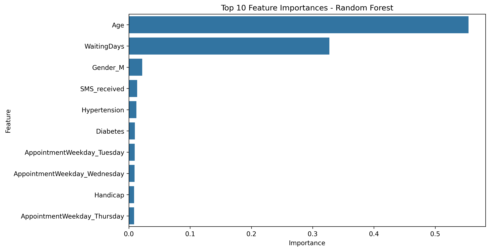
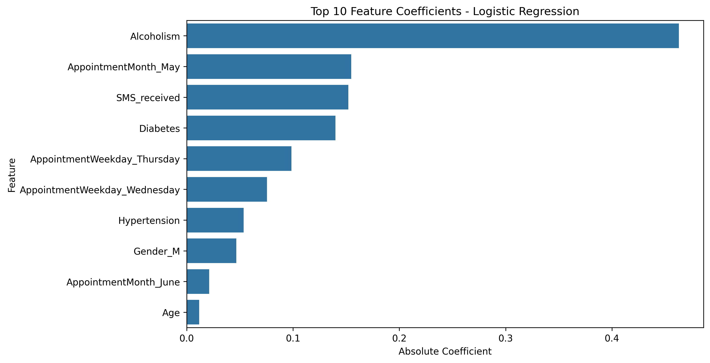
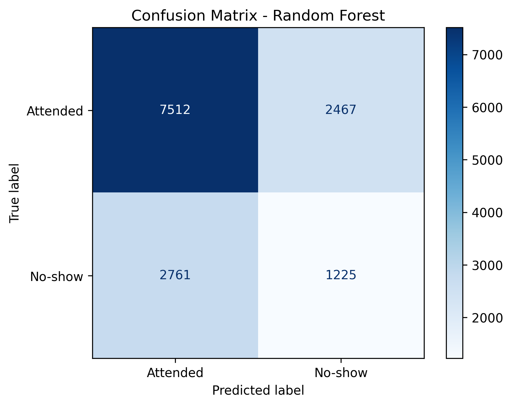

# Medical Appointment No-Show Prediction

A data science project analysing 110,000+ medical appointments in Brazil to identify the key factors that predict whether a patient will miss their appointment — and building a machine learning model to flag at-risk patients in advance.

---

## Project Overview

Missed medical appointments are costly for healthcare systems and patients alike. This project uses real appointment data to answer: **can we predict who is likely to no-show, and what factors drive that behaviour?**

---

## Dataset

- **Source:** [Kaggle — Medical Appointment No Shows](https://www.kaggle.com/datasets/joniarroba/noshowappointments)
- **Size:** 110,527 appointments across 14 columns
- **Target variable:** Whether the patient attended (`No_show`: Yes / No)
- **No-show rate:** ~20% of all appointments

---

## Project Structure

```
├── Medical_appointment_no-show_commented.ipynb   # Full annotated notebook
├── feature_importance_random_forest.png          # Random Forest feature importances
├── feature_coefficients_logistic_regression.png  # Logistic Regression coefficients
├── confusion_matrix_logistic_regression.png      # Confusion matrices for both models
└── README.md
```

---

## Methodology

### Phase 1 — Data Loading & Exploration
Loaded the dataset with pandas and explored shape, data types, and missing values. The dataset had no missing values but contained column name typos (`Hipertension`, `Handcap`) which were fixed during cleaning.

### Phase 2 — Data Cleaning
- Fixed misspelled column names
- Converted date columns to datetime format
- Removed impossible age values and negative waiting times
- Dropped duplicate rows

### Phase 3 — Exploratory Data Analysis
Key findings from EDA:
- Younger patients (18–35) have the highest no-show rates
- Patients who waited longer between booking and appointment were more likely to no-show
- SMS reminders had a small but positive effect on attendance
- Saturday appointments had the highest no-show rate; Thursday and Wednesday the lowest
- Patients with alcoholism had noticeably higher no-show rates

### Phase 4 — Feature Engineering
Created new features to improve model performance:
- `WaitingDays` — days between booking and appointment
- `AppointmentWeekday` — day of week of the appointment
- `AppointmentMonth` — month of the appointment
- `No_show_binary` — numeric target (0 = attended, 1 = no-show)
- One-hot encoded all categorical variables

### Phase 5 — Machine Learning
Trained two models and evaluated before and after applying `class_weight='balanced'` to correct for the 80/20 class imbalance:

| Model | Accuracy | Precision | Recall | F1 Score |
|---|---|---|---|---|
| Logistic Regression (before) | 0.714 | 0.364 | 0.001 | 0.002 |
| Logistic Regression (after) | 0.559 | 0.340 | 0.577 | 0.428 |
| Random Forest (before) | 0.652 | 0.349 | 0.251 | 0.292 |
| Random Forest (after) | 0.626 | 0.332 | 0.307 | 0.319 |

**Logistic Regression with balanced class weights was the best-performing model**, correctly identifying 57.7% of no-shows.

### Phase 6 — Feature Importance & Insights







---

## Key Findings

- **Waiting time and age are the strongest predictors** of no-show behaviour (Random Forest: 55% and 33% of importance respectively)
- **Alcoholism** was the strongest linear predictor in Logistic Regression
- **Raw accuracy is misleading** on imbalanced datasets — a model predicting "will attend" for everyone scores 71% accuracy while catching zero no-shows
- Applying balanced class weights improved Logistic Regression recall from near-zero (0.001) to 0.577
- The two models agreed on overall performance but disagreed on which features mattered most — suggesting both linear and non-linear relationships exist in the data

## Practical Recommendation

A clinic reminder system should prioritise outreach for:
1. Younger patients (especially 18–35)
2. Appointments booked far in advance
3. Patients with a history of alcoholism

---

## What I Learned

- How to handle **class imbalance** in real-world datasets and why accuracy alone is not a reliable metric
- The difference between **model accuracy and model usefulness** — optimising for recall over accuracy in a healthcare context
- How **Logistic Regression coefficients** and **Random Forest feature importances** can tell different but complementary stories about the same data
- The importance of **feature engineering** — WaitingDays, created from two date columns, became one of the most predictive features in the dataset

---

## How to Run

1. Clone this repository
2. Install dependencies:
```bash
pip install pandas matplotlib seaborn scikit-learn
```
3. Open the notebook:
```bash
jupyter notebook Medical_appointment_no-show_commented.ipynb
```
4. Update the file path in Cell 3 to point to your local copy of the dataset
5. Run all cells

---

## Tools & Libraries

- **Python 3**
- **pandas** — data loading, cleaning, and manipulation
- **matplotlib / seaborn** — visualisation
- **scikit-learn** — machine learning models and evaluation

---

*Project completed as part of a self-directed data science portfolio while transitioning into the field.*
